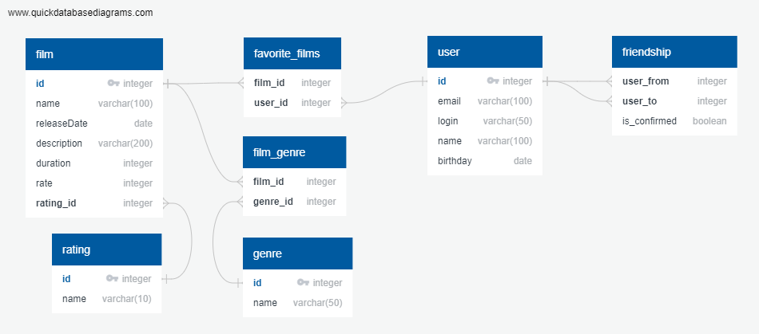

# java-filmorate

### Структура БД


### Примеры запросов
- Получение жанров фильма по идентификатору фильма:
```
SELECT g.name
FROM film AS f
LEFT JOIN film_genre AS fg ON fg.film_id = f.id
LEFT JOIN genre AS g on g.id = fg.genre_id
WHERE f.id = FILM_ID
```

- Получение рейтинга по идентификатору фильма:
```
SELECT r.name
FROM film AS f
INNER JOIN rating AS r ON r.id = f.rating_id
WHERE f.id = FILM_ID
```

- Получение друзей и статуса дружбы по идентификатору пользователя:
```
SELECT friend.name AS friend_name,
fs.name AS friendship_status
FROM user AS u
LEFT JOIN friendship AS f ON f.user_from = u.id
LEFT JOIN user AS friend WHERE friend.id = u.user_to
LEFT JOIN friendship_status AS fs ON fs.id = f.status_id
WHERE u.id = USER_ID
```

